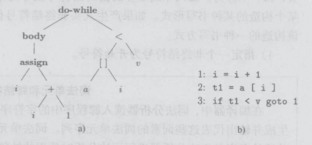

# 第2章 一个简单的语法制导编译器

>   建立一个能够将中缀算术运算表达式转换为后缀表达式的语法制导翻译器


```java
{
		int i;
		int j;
		float[100] a;
		float v;
		float x;
		while (true) {
				do {
						i = i + 1;
				} while (a[i] < v);
				do {
						j = j - 1;
				} while (a[j] > v);
				if (i >= j) {
						break;
				}
				x = a[i];
				a[i] = a[j];
				a[j] = x;
		}
}
```

> 扩展这个翻译器，使它能将上述程序片段转换为下述三地址代码


```
	 1:	i = i + 1
	 2:	t1 = a[i]
 	 3:	if t1 < v goto 1
	 4:	j = j - 1
	 5:	t2 = a[j]
	 6:	if t2 > v goto 4
	 7:	if False i >= j goto 9
	 8:	goto 14
	 9:	x = a[i]
	10:	t3 = a[j]
	11:	a[i] = t3
	12:	a[j] = x
	13:	goto 1
	14:
```


---

## 2.1 引言

> 编译器在分析阶段把一个源程序分成各个组成部分，并生成内部表示形式（中间代码）

分析阶段的工作围绕待编译语言的“语法“展开

- 程序设计语言的**语法**描述了该语言的程序的正确形式
- **语义**定义了程序的含义

- 在语法分析阶段被当作一个单元处理的单元被称作**词法单元**
  - 表达式`count + 1`中，标识符`count`被当作一个单元
  - **空白字符**有空格、制表符、换行符

- 两种中间代码形式
  - 抽象语法树（语法树）
  
    - 表示了源程序的层次化语法结构
  
    - 如图a，`do i = i + 1; while(a[i] < v);`
  
  - “三地址”指令序列
  
    - 最多只执行一个运算，通常是计算、比较或者分支跳转运算
    - 如图b，`do i = i + 1; while(a[i] < v);`



## 2.2 语法定义

> “上下文无关文法”简称”**文法**“，用于描述程序设计语言语法的表示方法


### 2.2.1 文法定义

一个**上下文无关文法**由四个元素组成

1. 一个**终结符号**集合：有时称**词法单元**，是该文法所定义的语言的基本符号的集合
   - 如：基本字、标识符、常数、算符、界符
2. 一个**非终结符号**集合：有时称**语法变量**，每个非终结符号表示一个终结符号串的集合
   - 如：算术表达式、布尔表达式、赋值句、分程序、过程
3. 一个**产生式**集合：每个产生式包括一个称为**产生式头**或**左部**的非终结符号，一个箭头，和一个称为**产生式体**或**右部**的由终结符号及非终结符号组成的序列
   - 主要用来表示某个构造的某种书写方式
4. 指定一个非终结符号为**开始符号**

> 零个终结符号组成的串称为**空串**

### 2.2.2 推导

- **语言**：可以从开始符号推导得到的所有终结符号串的集合称为该文法定义的语言
- **语法分析**的任务：接受一个终结符号作为输入，找出从文法的开始符号推导出这个串的方法

### 2.2.3 语法分析树

给定一个**上下文无关文法**，该文法的一棵**语法分析树**具有以下性质

- 根结点的标号为文法的开始符号
- 每个叶子结点的包好为一个终结符号或空串
- 每个内部结点的标号为一个非终结符号
- 如果非终结符号A是某个内部结点的标号并且它的子结点的标号从左到右分别为X1，X2，……，Xn，那必然存在产生式A ->X1X2……Xn
  - 如果A -> 空串是一个产生式，那么标号为A的结点可以只有一个标号为空串的子结点

> 为一个给定的终结符号串构建一棵语法分析树的过程称为对该符号串进行语法分析

### 2.2.4 二义性

> 一个文法可能有多棵语法分析树能够生成同一个给定的终结符号串的过程称为对该符号串进行语法分析