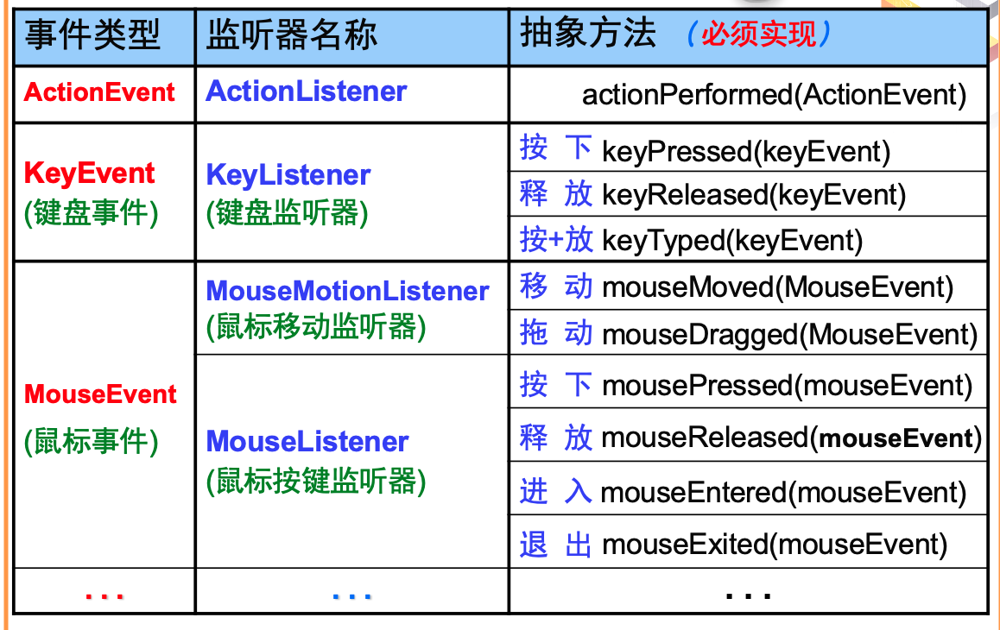

# **7. JavaGUI设计与事件处理**

- 本章学习Java语言的用户界面的设计，以及如何让用户和程序进行友好方便的交互。
  - 组件与容器
  - 布局管理器
  - 事件处理机制
  - 自定义绘画

---

## *7.1 Java的GUI概述*

### <1>Java的GUI设计

> - 在设计和实现图形用户界面的过程中，主要完成*两个*任务
>   - *创建窗口*并在窗口中*添加各种组件*，指定组件的属性和它们在窗口中的位置，从而构成图形界面的外观效果
>   - 定义图形界面的*事件和各种组件对不同事件的响应*，从而实现图形界面与用户的交互

- 一般可按照下列流程进行
  - 引入**Java**图形组件包**AWT**、**Swing**
  - 选择"外观和感觉"
  - 设置窗体属性
  - 设置组件布局
  - 向窗体中添加组件
  - 对组件进行事件处理

### <2>Java的图形用户界面AWT包

- **AWT**：*Abstract Window Toolkit*，第一代GUI开发工具
- **Swing**：第二代**GUI**开发工具，建立在**AWT**之上，但用新版本的组件替代了旧版本的组件
- 在**Java**中，**GUI**由以下五部分构成：
  - 图形界面组件：如：窗口、按钮、菜单等
  - 容器 ：是**GUI**元素的容器。实现组件管理、布局管理
  - 布局管理器：用来安排图形界面组件的位置
  - **Graphics**：在组件上进行图形绘制所使用的图形环境的父类
  - 事件处理对象：用来处理图形界面组件所触发的事件

---

## *7.2 组件与容器*

> - 组件*Component*：是GUI中最基本的组成部分，是一个可以图形化显示的，可以与用户进行*交互对象*。如：按钮、文本框
> - 容器*Container*：就是*组件放置*的地方。其本身可以看成是一个特殊的组件，只不过可以容纳其他的组件或容器
>   - *Container*类提供了一个public方法：*add()*，一个容器可以调用这个方法将组件添加到该容器中
>   - 容器调用*removeAll()*方法可以移掉容器中的全部组件；调用*remove(Component c)*方法可以移掉容器中参数c指定的组件
>   - *JFrame*是一个特殊的容器可以直接在桌面显示

### <1>JFrame类

1. **Java**提供的*JFrame*类的实例是一个底层容器，即通常所称的窗口。其他组件必须被添加到底层容器中，以便借助这个底层容器和操作系统进行信息交互
2. 当需要一个窗口时，可使用*JFrame*或其子类创建一个对象
3. 窗口也是一个容器，可以向窗口添加组件
4. 需要注意的是，窗口默认地被系统添加到显示器屏幕上，因此不允许将一个窗口添加到另一个容器中

### <2>JFrame常用方法

- JFrame构造方法:
  - JFrame() 创建一个无标题的窗口。
  - JFrame(String s) 创建标题为s的窗口。
- 常用方法:
  - public void setBounds(int a,int b,int width,int height)
  - public void setSize(int width,int height)
  - public void setLocation(int x,int y)
  - public void setVisible(boolean b)
  - public void setResizable(boolean b)
  - public void dispose()
  - public void setDefaultCloseOperation(int operation)
  - Container getContentPane()

### <3>常用组件

- 文本框：由JComponent的子类JTextField创建文本框
  - 构造函数：
    - JTextField();
    - JTextField(int columns);
  - 常用方法：
    - public String getText();
    - public void setText(String t);
- 文本区：由JComponent的子类JTextArea创建文本区
  - 构造函数：
    - JTextArea();
    - JTextArea(int rows, int columns)
  - 常用方法：
    - public String getText();
    - public void setText(String t);
- 按钮：由JComponent的子类JButton类用来创建按钮
  - 构造函数：
    - JButton();
    - JButton(String text) ;
  - 常用方法：
    - public void addActionListener(ActionListener l);
- 标签：由JComponent的子类JLabel类用来创建标签
  - 构造函数：
    - JLabel();
    - JLabel(String text);
    - JLabel(Icon image) ;
  - 常用方法：
    - public String getText();
    - public void setText(String t);
- 选择框：由JComponent的子类JCheckBox类用来创建选择框
  - 构造函数：
    - JCheckBox();
    - JCheckBox(String text) ;
  - 常用方法：
    - public void addItemListener(ItemListener l);
    - public void addActionListener(ActionListener l)
  - ItemListener接口中：
    - Object getItemSelectable()相当于getSource();
    - public int getStateChange();
    - 若被选中SELECTED/DESELECTED
- 单选按钮：由JComponent的子类JRadioButton类用来创建单项选择框
  - 构造函数：
    - JRadioButton();
    - JRadioButton(String text) ;
  - 常用方法：
    - public void addItemListener(ItemListener l)
  - 使用ButtonGroup区分不同组的单选按钮
- 下拉列表：由JComponent的子类JComboBox类用来创建下拉列表
  - 构造函数：
    - JComboBox();
    - JComboBox(Object[] items)
  - 常用方法：
    - public void addItemListener(ItemListener l)
    - public Object getSelectedItem();
    - public int getSelectedIndex()
- 密码框：由JComponent的子类JPasswordField创建密码框
  - 构造函数：
    - JPasswordField();
    - JPasswordField(int columns)
  - 常用方法：
    - public String getText();
    - public void setText(String t);
    - public void setEchoChar(char c)使用该方法重新设置回显字符
    - public char[] getPassword()方法可以返回实际的密码

### <4>其他容器

> JFrame是底层容器，本节提到的容器被习惯地称做中间容器，中间容器必须被添加到底层容器中才能发挥作用。

- *JPanel*面板:
- *JTabbedPane*选项卡窗格
- 滚动窗格*JScrollPane*
- 拆分窗格*JSplitPane*
- *JLayeredPane*分层窗格

### <5>JPanel面板

- 构造方法：*JPanel()*;
  - *JPanel p = new JPanel()*;
- 常用方法：*public void add()*;
- 使用*JPanel*创建面板，再向这个面板添加组件，然后把这个面板添加到其它容器中, *JPanel*面板的默认布局是*FlowLayout*布局

---

## *7.3 布局管理器*

> 当把组件添加到容器中时，希望控制组件在容器中的位置

- 每种布局都对应一种布局策略，分别是：
  - FlowLayout
  - BorderLayout
  - CardLayout
  - GridLayout
  - GridBagLayout
  - 空布局

> [!NOTE]
> 容器可以使用方法: *setLayout(布局对象);*来设置自己的布局

### <1>FlowLayout

> *FlowLayout*的布局策略是将容器中的组件按照加入的先后顺序从左向右排列。如果一行排满转下一行继续，每行均采取居中排列
>
> 是*Panel*型容器的默认布局，即Panel及其子类创建的容器对象，如果不专门为其指定布局，则它们的布局就是*FlowLayout*型布局

### <2>BorderLayout

> *BorderLayout*布局策略是把容器内的空间划分为东、西、南、北、中5个区域分别用英文的*East*、*West*、*South*、*North*、*Center*表示，向容器中加入每个组件都要指明在容器的区域
>
> 是*Window*型容器的默认布局，例如*Frame*、*Dialog*都是*Window*类的子类，它们的默认布局都是*BorderLayout*布局

### <3>CardLayout

> 使用*CardLayout*的容器可以容纳多个组件，但是实际上同一时刻容器只能从这些组件中选出一个来显示，就像一叠"扑克牌"每次只能显示最上面一张一样，这个被显示的组件将占据所有的容器空间，依次排序

### <4>GridLayout

> *GridLayout*的布局策略是把容器划分成若干行乘若干列的网格区域，组件就位于这些划分出来的小格中
>
> *GridLayout*比较灵活，划分多少网格由程序自由控制，而且组件定位也比较精确
>
> 由于*GridLayout*布局中每个网格都是相同大小并且强制组件与网格的大小相同，使得容器中的每个组件也都是相同的大小，显得很不自然, 为了克服这个缺点，可以使用容器嵌套

### <5>GridBagLayout

> 将组件排列在一行或一列，这取决于创建盒式布局对象时，是否指定了是行排列还是列排列
>
>使用行（列）型盒式布局的容器将组件排列在一行（列），组件按加入的先后顺序从左（上）向右（下）排列，容器的两端是剩余的空间
>
> 和*FlowLayout*布局不同的是，使用行型盒式布局的容器只有一行（列），即使组件再多，也不会延伸到下一行（列），这些组件可能会被缩小大小，紧缩在这一行（列）中

---

## *7.4 事件处理机制*

### <1>交互处理方式分析

- 处理"人-机"交互的两种方式
  - 查询处理方式
    - C等传统语言的方式
    - 主要用于Dos等*命令行环境下程序设计*
  - 事件处理机制
    - Java、Visual C++的方式
    - 主要用于*Windows程序*和*多线程程序*设计
- 两种处理方式进行比较的*内容*
  - 如何"查询"
  - 软件设计人员的需要完成的工作

### <2>两种方式比较

#### [1]如何"查询"

- 看护小宝宝"换尿布"的方式
  - 传统方法：每过一会就摸摸...如果尿布湿了，换新的
  - 新方法：尿布自动报警器(湿敏电阻)
- 比较
  - 工作方式：由 "*监测->处理*" 变为 "*提醒告知*"
  - 新方法*优点*：提高并发度、效率
  - 新方法*缺点*：提高了复杂度 (价格...)
- 程序设计的思路：*查询 -> 报告*

#### [2]程序员的工作

> "查询"方式下软件设计者要完成的工作

例. 如何处理鼠标的*多种操作*


- 实现方式
  - "*查询*"
  - 对操作类型逐个比较
- 设计工作
  - 判断发生交互种类
  - 设计"*处理*"代码
  - "*交互*"和"*处理*"代码的组织方式
- 缺点
  - 需编程判断交互类型
  - "*交互*"和"*处理*"的代码交织在一起
- 事件处理机制
  - Java、Visual C++的方式，应对
    - 多道程序系统：*程序执行效率*
    - 图形化界面程序设计：*大量复杂交互*
  - *由程序运行环境*检测"事件"发生与否,由程序运行环境*自动调用*相应的事件处理代码
  - 软件设计者只要关心
    - *会发生*哪些"交互事件"
    - *如何处理*"交互事件"

- **优点**
  - 多道程序时，系统执行效率提高
  - **Java**虚拟机全权处理，程序员只需专注功能设计
  - 对复杂程序（复杂交互）的处理便利、结构清晰

> [!NOTE]
> 高效率

### <3>事件机制的几个概念


- **事件源** 描述人机交互中事件的来源(*EventSource*), 通常是Java图形包中*组件*
- **事件** 事件源产生的交互内容，如"按下鼠标"(*ActionEvent*), 在*java.awt.event*包中定义的类
- **事件监听器** 接收事件并进行处理，由程序员编写(*ActionListener*), 对应处理所监听事件源产生的事件 
- **监听器接口** 编写"事件监听器"的"*规定*" – "*抽象方法*", 必须在监听器类中实现这些方法完成事件处理
- *监听器注册* 将事件监听器对象*绑定*到事件源，进行监听

```java
class ButtonListener implements ActionListener {
    public void actionPerformed() {
      /**  按钮事件所进行的具体工作  **/
    }
}
```

### <4>常用事件类

- "实现了某种类型的监听器接口"的类的对象,如何编程实现监听器?
  - 每一个事件类都有唯一的事件处理方法接口，例如，对于处理鼠标事件"*MouseEvent*"类的对应接口为"*MouseListener*"
  - 每一个接口中都已经规定了一个空的抽象方法在该方法中编码实现自己想做的的工作

事件类型|典型触发动作
-------|----------
ActionEvent|*按钮*、列表双击、单击菜单项目
KeyEvent|*键盘*的输入
MouseEvent|*鼠标*拖动、移动、单击、按下、释放或者进入、退出组件的事件
ComponentEvent|组件被隐藏、移动、尺寸调整或变为不可见的事件
FocusEvent|组件获得或失去焦点的事件
InputEvent|复选框和列表项单击、控件的选择和可选菜单项的选择事件
TextEvent|文本区域或者文本区域的值的改动
WindowEvent|窗口激活、失去活动窗口、最小化、最小化、打开、关闭或者退出的事件

### <5>事件监听器

- "实现了某种类型的监听器接口"的类的对象，如何编程实现监听器?
  - 每一个事件类都有唯一的事件处理方法接口，例如，对于处理鼠标事件"*MouseEvent*"类的对应接口为"*MouseListener*"
  - 每一个接口中都已经规定了一个空的抽象方法在该方法中编码实现自己想做的的工作


事件类型|典型触发动作
-------|----------
ActionListener|处理*按钮*、列表、双击、单击菜单项目
KeyListener|处理*键盘*的输入
MouseListener|处理*鼠标*拖动、移动、单击、按下、释放或者进入、退出组件的事件
ComponentListener|处理组件被隐藏、移动、尺寸调整或变为不可见的事件
FocusListener|处理组件获得或失去焦点的事件
InputListener|处理复选框和列表项单击、控件的选择和可选菜单项的选择事件
TextListener|处理文本区域或者文本区域的值的改动
WindowListener|处理窗口激活、失去活动窗口、最小化、最小化、打开、关闭或者退出的事件

### <6>"事件源-监听器-抽象方法"对应



- 如何将监听器绑定到组件？
  - 每个组件都提供了用于绑定监听器的方法
  - 通过观察 "add*xxx*Listener" 方法的名称，可以很容易地知道其能够处理的事件类型

### <7>单事件源的"多个事件"

- 学生可发生多种事件
- 教师、辅导员、医生的共同点：都受过"专业培训


### <7>程序设计.例一

- 程序功能需求
  - 绘制一个窗体
  - 窗体内绘制一个按钮，名为"点我"
  - 按下按钮时，在命令行打印信息打印内容为"*我知道你按下按钮啦！*"
- 解决方法
  - 设计自己的带有按钮的窗体类(派生自*Java.awt.Frame*类)
  - 设计自己的按钮事件监听器类(实现*ActionListener*接口、并完成*ActionPerformed*方法)
  - 创建按钮事件监听器类对象，并绑定到"按钮"上(调用按钮类的*addActionListener*方法)

> Code

```java
import java.awt.*;
import java.awt.event.*;

class ButtonListener implements ActionListener {
    public void actionPerformed (ActionEvent e) {
        System.out.println ("我知道你按下按钮啦");
    }
}

class myButtonFrame extends Frame {
    Button btn;
    myButtonFrame(String s) {  //构造函数
    super(s);
    this.setSize(200, 120);
    /* 创建按钮*/
    btn = new Button("点击");
    this.add(btn);
    // 事件监听器创建和注册
    ButtonListener bl = new ButtonListener();
        btn.addActionListener(bl);
    }
}

// 主类
public class ActionEventTest {
    public static void main(String args[]){
        myButtonFrame frm = new myButtonFrame("ActionEventTest");
        //  显示窗体
        frm.show();
    }
}
```

---

## *7.2 自定义绘画*

### <1>用户自定义绘画

> 用户要完成自定义绘画需要"画笔"、"画布"两种
>
> 画布的选择：可以通过继承*JPanel*或者*JLabel*类，完成画布的创建
>
> - 画笔的获得：从画布上拿起画笔, 重写
>   - public void paintComponent(Graphics g)
>   - 参数Graphics对象就是画笔
> - 重新绘制的方法：
>   - void repaint()
>   - void repaint(int, int, int, int)

### <2>绘制简单的图形和文字 - Graphics

- Graphics类提供基本绘图方法，主要有：
  - 画线段：
    - public abstract void drawLine(int x1, int y1, int x2, int y2)
  - 画矩形：
    - public void drawRect(int x, int y, int width, int height)
    - public void fillRect(int x, int y, int width, int height)


### <3>使用图像

- 获得图像：使用 Toolkit 的 getImage 方法
  - Image getImage(URL url)
  - Image getImage(String filename)
- 使用方法：

```java
Toolkit toolkit = Toolkit.getDefaultToolkit();
Image image1 = toolkit.getImage("imageFile.gif");
Image image2 = toolkit.getImage(new URL("http://java.sun.com/graphics/people.gif"));
```

- 显示图像：使用Graphics对象的方法

```java
boolean drawImage(Image img, int x, int y, ImageObserver observer)
boolean drawImage(Image img, int x, int y, int width, int height, ImageObserver observer)
boolean drawImage(Image img, int x, int y, Color bgcolor, ImageObserver observer)
boolean drawImage(Image img, int x, int y, int width, int height, Color bgcolor, ImageObserver observer)
```

上一篇：
> [!div class="nextstepaction"]
> [Java输入输出系统](Java输入输出系统.md)

下一篇：
> [!div class="nextstepaction"]
> [Java多线程程序设计](Java多线程程序设计.md)