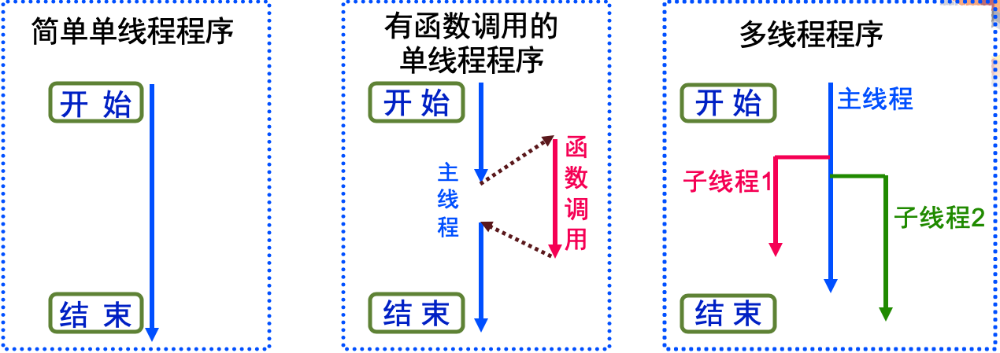
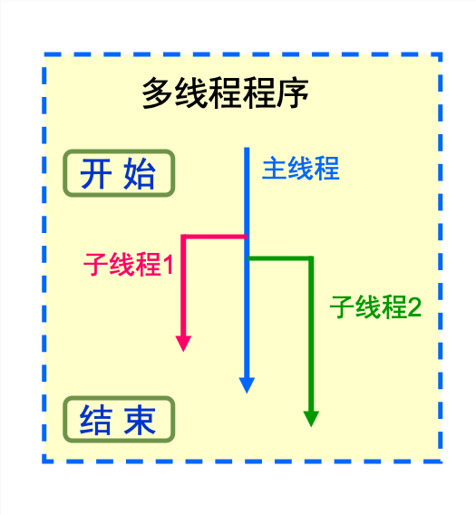
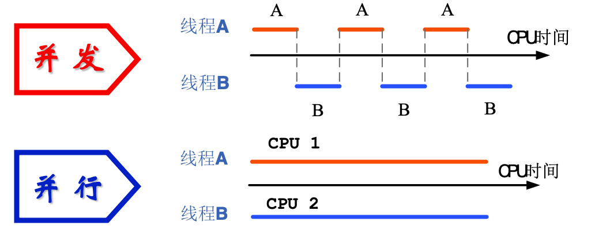
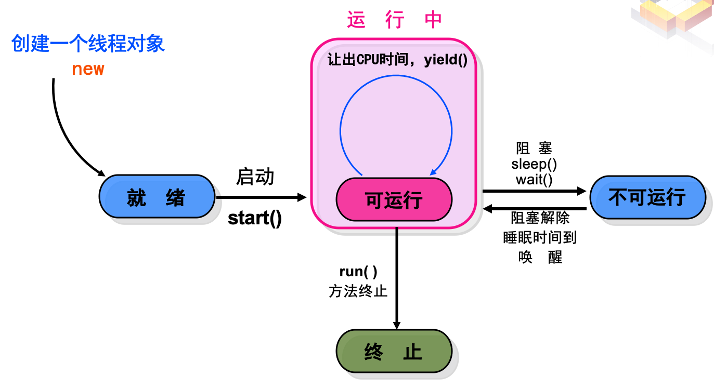
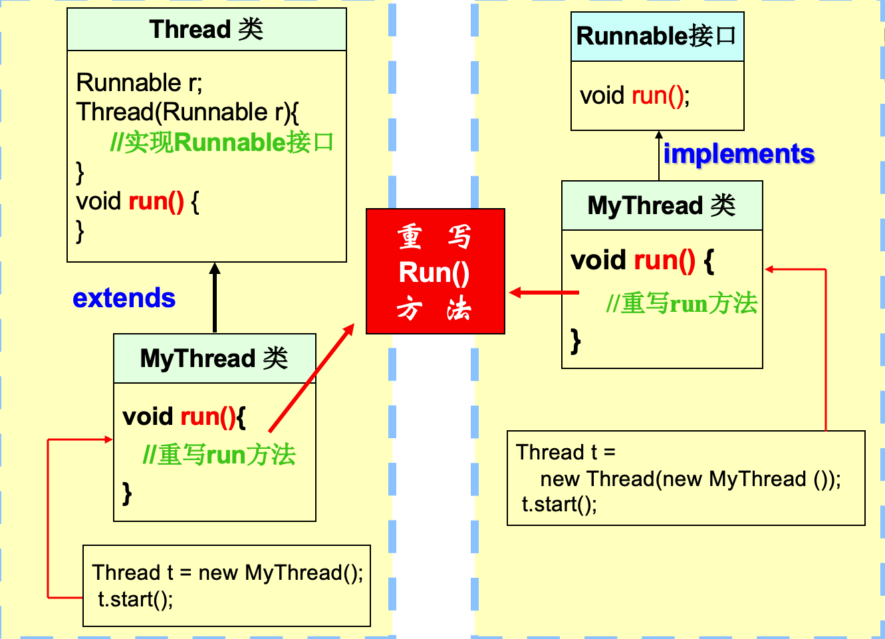

# **8. 多线程程序设计**

- 线程概念的理解
- 线程的状态
- **Java**程序中创建线程的方法
- 线程常用方法
- 线程的同步与互斥

---

## *8.1 线程概述*

### <1>一个例程

> 在窗体中绘制一个"*会运动的、碰壁后会反弹的*"小球

#### [1]程序主体框架

```java
// 定义带有"球"的窗体类
class MyFrame extends Frame {
    …    // 窗体的属性设置
    inner class Ball { // 定义球类
        …  // 球的属性设置
        …  // 球的运动方法
    }
}
```

```java
// 程序主类
class DrawSingleBall {
    public static void main(..) {
        // 创建窗口
        new MyFrame
        …
        // 球开始运动
        …
    }
}
```

#### [2]常用软件分析

- 目前大多数软件都是基于**多线程**开发的
  - *Windows Media Player*
  - 暴风影音
  - *Winamp*
  - *Powerpoint*
  - *QQ、MSN*
  - 游戏（*CS、SC*）
  - …

### <2>程序执行的线索



- 线程：是一个*程序内部*的*顺序控制流*
- 多线程：
  - 在同一个应用程序中的多个顺序控制流"*同时*"进行
  - *并发*与*并行*

### <3>多线程的动机

> [!div class="checklist"]
> * 采用多线程技术的**动机**
>   - 问题：程序的某部分与特定的事件或资源联系在一起，而设计者不想让这种联系阻碍程序其余部分运行
>   - 解决：创建一个与事件或资源关联的线程，并且让此线程独立于主线程运行

- 一个程序在其执行过程中，可以产生多个线程，形成多条执行线索。每条线程，有产生、存在和消亡的过程。
- 程序中多个线程，按照自己的执行路线并发工作，独立完成各自的功能，互不干扰

---

## *8.2 Java线程的状态*

### <1>Java程序的执行

- 每个**Java**程序都有一个缺省的主线程
  - **Java**应用程序总是从主类的*main()*方法开始执行
  - *main()*方法执行过程中可以创建其它线程
- 程序执行情形
  - 如果*main()*方法中没有创建其它的线程，*main()*方法返回时，结束Java应用程序
  - 如果*main()*方法中创建了其它线程，在主线程和其它线程之间轮流切换执行，保证每个线程都有机会使用*CPU*
  - 直到程序中所有线程都结束，**Java**应用程序才结束



### <2>Java多线程的执行

- 单**CPU**如何实现多线程的并行执行
  - 划分极短的**CPU***时间片*
  - 各线程*轮流*占用一个时间片



- **Java**的多线程
  - **Java**虚拟机获得的总*CPU时间*内，在若干个*独立*的可控制的线程之间切换

### <3>多线程竞争CPU

> 例：某寝室凑钱买了一台💻，约定轮流使用
>
> - 如何轮流使用？
>   - 等某人良心发现，主动放弃
>   - 约定好每人每次使用时间（时间片）
>   - "大股东"，优先使用
>   - 某人有急事，临时"抢用"

#### [1]线程的状态

> 线程可以处于以下四种状态之一：

- 就绪：线程对象已建立，但*尚未启动*，还不能运行
- 可运行：
  - 线程已经启动，等待获得*CPU时间片*执行
  - 获得*CPU时间片*的线程开始执行
  - 获得*CPU时间片*的线程可以放弃当前执行机会，等待下次执行
- 不可运行：
  - 不分配给线程*CPU*时间，直到线程重新进入就绪状态
  - 原因：*阻塞、线程睡眠(sleep)、线程挂起(wait)*
- 终止：线程结束的*正常方式*是从*run()*方法返回

#### [2]线程状态的转换



---

## *8.3 Java线程的创建*

### <1>创建线程

- java.lang.Thread类
  - 专门用来创建线程和对线程进行操作的类
  - 定义了许多对线程进行操作的方法
  - *特殊的run()方法*
- 创建线程有两种方法
  - 继承*Thread*类
  - 通过定义实现*Runnable*接口

> [!NOTE]
> 详细内容见软件包java.lang.thread的Thread类

#### [1]创建线程方法一

- 编写自己的类
  - 该类是*java.lang.Thread*类的子类
  - 该子类应*重写Thread类*的*run()*方法
  - 准备在线程中完成的工作放在*run()*方法实现

```java
//-------------------------------------------
class MyThread extends Thread { // 定义MyThread类
    //定义成员属性……
    MyThread () {  // 构造方法
        ……
    }
    public void run() {
        // 完成要完成的工作
        ……
    }
}
//--------------------------------------------
```

#### [2]创建线程方法二

- 编写自己的类
  - 实现*Runnable*接口
  - 该子类应*重写Runnable*接口的*run()*方法
  - 准备在线程中完成的工作放在**run()**方法实现

```java
//-------------------------------------------
class MyThread implements Runnable {
    //定义成员属性
        ……
    MyThread () { // 构造方法
        ……
    }
    public void run() {
        // 完成要完成的工作
        ……
    }
}
//--------------------------------------------
```



### <2>实例

- 程序功能需求
  - 程序完成两个子任务
  - 每个子任务各自在命令行打印信息
  - 打印内容为：
    - "自己的名称和遍数"
    - "打印结束提示"
- 解决方法
  - 设计自己的线程类(派生自*Thread类*或实现*Runnable接口*)
  - 在主线程(*main*方法)中创建两个线程

```java
//通过继承Thread类实现多线程
class myThread extends Thread {
    private String tname;   //线程名
    private int count;          //循环次数
    //构造方法
    myThread (String s, int c) {
        tname = s;
        count = c;
    }  
    //一定要实现run方法
    public void run() {
        for (int i = 1; i <= count; i++) {
            System.out.println(tname + i);
        }
        System.out.println(tname + " finished!");
    }
}

//主类
public class Thread_1 {
    public static void main(String args[]) {
        //创建线程A
        myThread ta = new myThread("A", 10);
       //创建线程B
        myThread tb = new myThread("B", 10);
        //调用start方法
        ta.start();
        tb.start();
    }
}
```

> [!NOTE]
> 1.先创建*myThread*的两个对象*ta*和*tb*
>
> 2.分别调用其start方法启动两个线程

---

## *8.4 多线程的互斥与同步*

### <1>多线程间的关系

- 在多线程环境中，可能会有两个甚至更多的线程*试图同时访问*一个有限的资源。必须对这种潜在资源冲突进行预防
  - *互斥*
  - *同步*
- 解决方法：
  - 在线程使用一个资源时为其*加锁*即可。
  - 访问资源的第一个线程为其加上锁以后，其他线程便不能再使用那个资源，除非被解锁

> 线程引发的不确定性

```java
class Cbank{//银行类
    private static int s = 1000;
    public static void sub(int m) {  //取款
        int temp = s;
        temp = temp - m;
        try {
            Thread.sleep((int)(1000 * Math.random()));
        }
        catch(InterruptedException e){}
        s = temp;
        System.out.println("s = " + s);
    }
}

class Customer extends Thread {  //储户类
    public void run() {
        for(int i = 1; i <= 5; i++)
        Cbank.sub(100);
    }
}

class Thread_3 {
    public static void main(String args[]) {
        Customer Customer1 = new Customer();
        Customer Customer2 = new Customer();
        Customer1.start();
        Customer2.start();
    }
}
```

### <2>多线程互斥的关键

- 对于访问某个关键共享资源的所有方法，都必须把它们设为*synchronized*，例如：
  - synchronized void f() { /* ... */ }
  - synchronized void g() { /* ... */ }
- 当一个线程A使用一个*synchronized*修饰的方法时，其它线程想使用这个方法时就必须等待，直到线程A 使用完该方法 （除非线程A主动让出*CPU*资源）
- 如果想保护某些资源不被多个线程同时访问，可以强制通过*synchronized*方法访问那些资源。
  - 调用*synchronized*方法时，对象就会*被锁定*
  - 当*synchronized*方法执行完或发生异常时，会自动释放锁
  - 被*synchronized*保护的数据应该是*私有*（*private*）

```java
class Cbank {
    private static int s = 1000;
    public synchronized static void sub(int m) {
        int temp = s;
        temp = temp - m;
        try {
            Thread.sleep((int)(1000 * Math.random()));
        } catch(InterruptedException e) {
        }
        s = temp;
        System.out.println("s="+s);
    }
}

class Customer extends Thread {
    public void run() {
        for(int i = 1; i <= 5; i++)
        Cbank.sub(100);
    }
}

//main class
class Thread_4 {
    public static void main(String args[]){
        Customer Customer1 = new Customer( );
        Customer Customer2 = new Customer( );
        Customer1.start();
        Customer2.start();
    }
}

```

### <3> 线程的阻塞状态

- 一个线程进入阻塞状态(暂停执行)，可能有如下原因：
  - 通过调用*sleep(milliseconds)*使线程进入休眠状态，在这种情况下，线程在指定的时间内不会运行
  - 通过调用*wait()*使线程挂起。直到线程得到了*notify()*或*notifyAll()*消息，线程才会进入就绪状态
  - 线程在等待某个*输入/输出*完成
  - 线程试图在某个对象上调用其同步控制方法，但是对象锁不可用

### <4>wait()、notify 和notifyAll()方法

- *挂起*——就是让线程暂时让出*CPU*的使用权限，暂停执行
  - 挂起一个线程需使用*wait*方法，即让准备挂起的线程调用*wait*方法，主动让出CPU的使用权
  - **Java2**中已经废止了以前的*suspend()*方法
- *通知*——恢复处于挂起状态线程的运行
  - 其它线程在占有*CPU*资源期间，让挂起的线程的目标对象执行*notify()*方法，使得挂起的线程继续执行
  - 如果线程没有目标对象，为了恢复该线程，其它线程在占有CPU资源期间，让挂起的线程调用*notifyAll()*方法，使挂起的线程继续执行

### <5>yield(), sleep(), wait()

- 都是中止当前线程线程的执行
- 区别
  - *yield()*: "让步"
    - 线程放弃当前的*CPU*使用权，但将*CPU*资源让出来后马上重新参加CPU资源竞争；
    - 线程会自动回到执行状态
  - *sleep()*:
    - "休眠"使线程停止执行一段时间，该时间由你给定的毫秒数决定；
    - 线程会自动回到执行状态
  - *wait()*
    - "挂起"线程将释放所有资源，等得到通知后在参加资源竞争；
    - 启动办法是*notify()*和*notifyAll()*方法

上一篇：
> [!div class="nextstepaction"]
> [Java GUI设计与事件处理](JavaGUI设计与事件处理.md)

下一篇：
> [!div class="nextstepaction"]
> [Java网络通信](Java网络通信.md)
