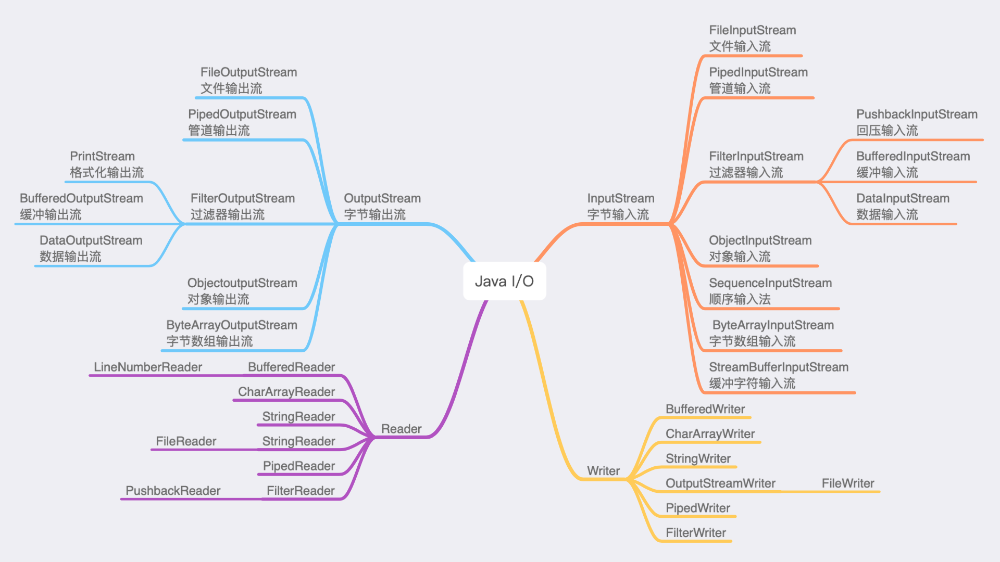
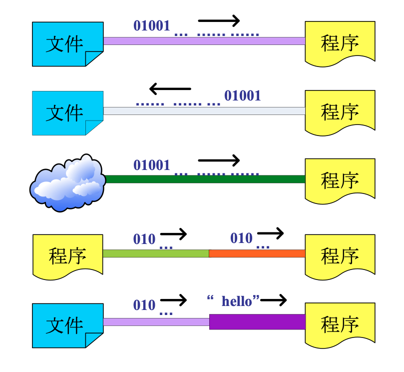
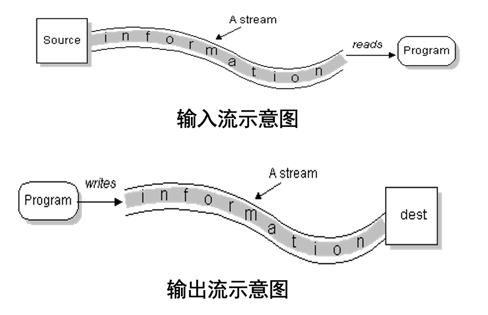
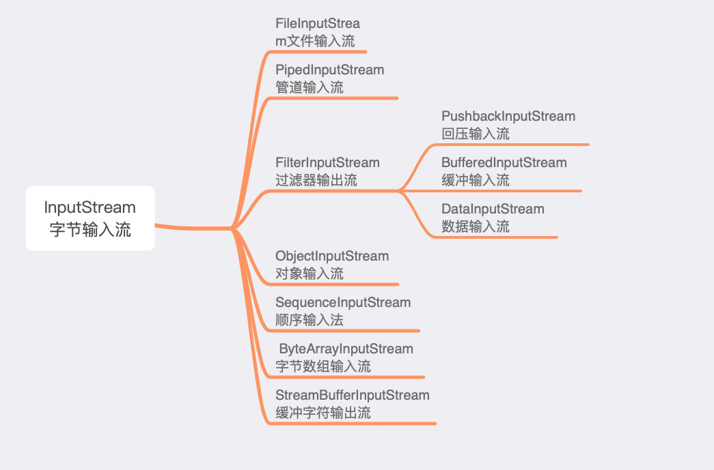
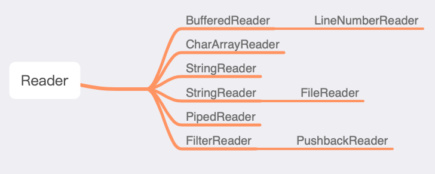
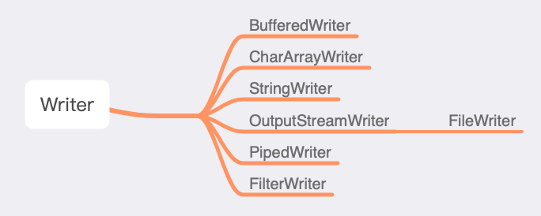

# **6. Java输入输出系统**

---

## *6.1 Java I/O 流描述*



### <1>输入输出类库

输入和输出是*程序与用户之间沟通的桥梁，是程序和用户进行信息交互的重要手段*



- **Java**的输入输出是以流（*stream*)的方式进行处理的，流是在计算机的输入、输出操作中流动的数据序列
- **Java**按流的单位分有位流（字节流）和字符流；按流动方向分为输入流和输出流



### <2>I/O 流的分类

- 按所读写的数据类型分两类：
  - **字节流类**（*Byte Streams*） 字节流类用于向字节流读写单个字节（8 bit）。一般地，字节流类主要用于读写诸如图象或声音等的二进制数据（面向计算机）
  - **字符流类**（*Character Streams*） 字符流类用于向字符流读写一个字符（一个字符根据编码的不同，对应的字节也不同）。字符流类用来处理文本文件（面向人类）
  - **Java SDK**所提供的所有流类型位于*java.io*包内部，全部继承自以下**四种抽象流类型*

流类型|字节流|字符流
-----|------|-----
输入流|InputStream|Reader
输出流|OutputStream|Writer

---

## *6.2 文件处理*

> - 在程序中要对磁盘文件或目录进行操作，首先要对文件或目录建立连接，为此**Java**提供了*File*类
> - *File*类位于*java.io*包中，但不是流类，它不负责输入或输出，而专门用来管理磁盘文件和目录

- 类的构造方法

构造方法|描述
public File(String pathname)|根据路径名创建对象
public File(String parent, String child)| 根据父目录路径名以及字文件/目录名创建对象
public File(File parent, String child)|根据父对象以及字文件/目录名创建对象

```java
//Windows中路径分隔可使用/或\\
File file1 = new File("d:\\java\\a.txt");
File file2 = new File("d:\\java", "a.txt");
File file3 = new File(new File("d:\\", "java\\a.txt");
```

- *File类的常用方法*

方法名|描述
------|---
exists()|判断文件的目录是否存在，存在返回true，否则返回false
createNewFile()|创建文件，返回类型boolean
isFile()|判断是否是文件，是文件返回true
isDirectory()|判断是否是目录，是目录返回true
getName()|获取文件或目录名称，返回类型String
getPath()|获取文件或目录的路径，返回类型String
getAbsolutePath()|获取文件或目录的绝对路径。返回类型String
listFiles()|获取指定目录下的所有文件，返回File[]数组
lastModified()|获取文件或目录的最后修改时间返回类型long
length()|获取文件或目录的大小，单位为字节，返回类型long
mkdir()|创建目录，返回类型boolean
static listRoots()|获取可用文件的根目录，返回类型File[]
delete()|删除文件或目录，返回类型boolean
mkdirs()|创建多级目录，返回类型boolean
renameTo(File dest)|重命名（剪切功能），返回类型boolean

- *File*类 - 注意事项
  - delete()方法在删除目录时如果其内有内容则无法删除，需要先清空目录下的内容，再删除目录本身
  - *isDirectory()*和*isFile()*方法在判断是否为文件或者目录时，如果文件或目录不存在则返回false
  - *createNewFile()*方法在创建文件时，如果文件所在的目录不存在则创建失败并抛出异常
  - *String[] list()*和*File[] listFiles()*都是返回对象包含的所有的文件和目录，返回类型不同

---

## *6.3 字节流*

> - 字节流
>   - 可以直接处理字节信息的流对象
>   - 计算机中一切数据都是字节数据，无论是文字、音频、图片、视频、网页等内容，底层都是字节数据
>   - 字节流可以操作计算机中一切数据
>   - 所有其他流对象，底层都需要依赖字节流
>   - 顶层的抽象类：
>     - *InputStream*
>     - *OutputStream*

### <1>InputStream类

> [!NOTE]
> 是字节输入流的顶层抽象父类，定义了字节输入流应该具有的功能。

- 常用方法
  - *int read()*
    - 返回一个字节
  - *int read(byte[] arr)*
    - 将读取到的数据，存储在arr数组中
    - 返回的数据表示本次读取到的数据的个数
  - *available()*
    - 从该流中，还能读多少字节出来 
  - *close()*
    - 关闭流对象

### <2>InputStream子类

输入流类*InputStream*流，此抽象类是表示字节输入流的所有类的超类，其主要子类如下



### <3>FileInputStream类

- 用于从文件File中将文件的原始字节的数据流读出
- 构造方法：
  - FileInputStream(File f)
  - FileInputStream(String pathname)
- 常用方法，使用从InputStream类继承来的就好
  - int read()
  - int read(byte[] arr)
  - available()
  - close()

### <4>OutputStream类

- 是字节输出流的顶层抽象父类，至少应该有一个写出一个字节的方法
- 常用方法：
  - write(int b)
    - 将一个字节存储到目标文件中
  - write(byte[] arr)
    - 将指定的字节数组中的全部字节，写出到目标文件中
  - write(byte[] arr, int offset, int len)
    - 将指定的字节数组的一部分，写出到目标文件中
    - 从offset索引开始，一共len个字节
  - close()
    - 关闭流对象

### <5>OutputStream子类

*OutputStream*，此抽象类是字节输出流的所有类的超类，其主要子类如下


### <6>FileOutputStream类

将原始字节的数据流写入**File**

- 构造方法：
  - FileOutputStream(String path)
  - FileOutputStream(File f)
    - 创建一个输出到指定文件中的字节输出流，如果指定文件存在，则清空
  - FileOutputStream(String path, boolean append)     FileOutputStream(File f, boolean append)
    - 创建一个输出到指定文件中的字节输出流，如果指定文件存在，append值为true，则在末尾追加
- 常用方法：同父类

---

## *6.4 字符流*

- 字符流用于直接操作字符的流对象
- 字符流是在字节流的基础上实现的，字符流将字节流按照相应的编码方式转化为字符流，从而变成人类可以读懂语句
- 字节流面向计算机，字符流面向人类
- 顶层抽象类
  - Reader
  - Writer

### <1>Reader类

> 用来以字符方式从流中读入数据，*Reader*类中包含了一套所有字符输入流都需要的方法，可以完成最基本的从字符输入流读取数据的功能

- 常用方法：
  - int read()
    - 读取一个完整的字符，如果返回-1表示到达文件末尾
  - int read(char[] chs)
    - 读取一系列字符到一个字符数组中
  - close()
    - 关闭流对象

### <2>Reader子类

- *Reader*，此抽象类是表示字符输入流的所有类的超类，其主要子类如下



### <3>InputStreamReader

> *InputStreamReader*：字节流转字符流，它使用的字符集可以由名称指定或显式给定，否则将接受平台默认的字符集

- 构造方法：
  - InputStreamReader(InputStream in)
  - InputStreamReader(InputStream in, Charset cs)
  - InputStreamReader(InputStream in, CharsetDecoder dec)
  - InputStreamReader(InputStream in, String charsetName)
- 特有方法：
  - String getEncoding()

### <3>FileReader

- 按照字符的方式，从文件读取信息
- 构造方法：
  - FileReader(String path)
  - FileReader(File f) 
    - 将路径封装成字符文件输入流对象
- 常用方法：同父类
  - int read() 
    - 读取一个完整的字符，如果返回-1表示到达文件末尾
  - int read(char[] chs)
    - 读取一系列字符到一个字符数组中
  - close()
    - 关闭流对象

### <4>Writer类

> 用来以字符方式向输出流中写入数据

用法|作用
----|---
writer(int c)|将一个字符写出到目标文件
write(char[] chs)|将一个字符数组写出到目标文件
write(char[] chs, int offset, int len)|将一个字符数组中的从offset开始一共len个字符写出到目标文件
write(String str)|写出一个字符串
write(String str, int offset, int len)|将字符串的一部分写出
flush()|刷新缓冲区
close()|关闭流对象

### <5>Writer子类

> Writer，此抽象类是表示字符输出流的所有类的超类，其主要子类如下



### <6>OutputStreamWriter类

- OutputStreamWriter：字节流转字符流
- 构造方法：
  - OutputStreamWriter(OutputStream out)
  - OutputStreamWriter(OutputStream out, Charset cs)
  - OutputStreamWriter(OutputStream out, CharsetEncoder enc)
  - OutputStreamWriter(OutputStream out, String charsetName)
- 特有方法：
  - String getEncoding()

### <7>FileWriter

- 用来写入字符文件的类
- 构造方法：
  - FileWriter(String path)
  - FileWriter(File f)
    - 将一个路径封装成字符输出流，如果文件存在，则先清空
  - FileWriter(String path, boolean append)
  - FileWriter(File f, boolean append)
    - 将一个路径封装成字符输出流，如果第二个参数为true，则在文件存在的情况下，可以追加
- 常用方法：同父类

### <8>带缓冲区的字符流

> 包装类，将没有缓冲功能的普通字符流，包装加强之后形成高效的缓冲字符流包装类也是顶层抽象父类的子类

- BufferedReader构造方法：
  - BufferedReader(Reader r)
  - BufferedReader(Reader in, int sz)
- BufferedWriter构造方法
  - BufferedWriter(Writer w)
  - BufferedWriter(Writer out, int sz)
- BufferedReader特有方法：
  - String readLine()
- BufferedWriter特有方法：
  - void newLine()

---

## *6.5 基本流*

为了减少程序开发人员，因频繁应用标准的输入输出设备，需要频繁地建立输入输出流对象的工作量，**java**系统*预先定义好3个流对象*，分别表示标准输出设备、标准输入设备和标准错误设备，他们分别是：

- System.in  ：用于程序的输入；      对应外设为键盘
- System.out：用于一般输出；         对应外设为屏幕
- System.err：用于显示出错信息；  对应外设为屏幕

> *System*类的所有属性都是静态*static*的，调用时以类名*System*为前缀

上述3个流对象均为静态属性

> Code - 基本 I/O 之例

```java
//从键盘输入字符，然后在屏幕上显示输入结果
import java.io.*;
public class standardIO {
    public static void main(String[] args) throws IOException {
    //IO操作必须捕获IO异常
    char c;
    System.out.println("输入任一字符 ");
    c = (char)System.in.read();
    System.out.println("输入的字符是：" + c);
    }
}
```

```java
//基本IO standardIO2.java，从命令行读入字符串，并处理和显示
import java.io.*;
public class standardIO2 {
    public static void main(String[] args) throws IOException {
        //IO操作必须捕获IO异常
        //先使用System.in构造InputStreamReader，再构造BufferedReader。
        InputStreamReader iin = new InputStreamReader(System.in);
        BufferedReader stdin = new BufferedReader(iin);
        //读取并输出字符串
        System.out.print("Enter a string: ");
        System.out.println(stdin.readLine());
        //读取字符串并转换成double类型数据输出
        System.out.print("Enter a double: ");
        //将字符串解析为带符号的double类型数据。
        double number2=Double.parseDouble(stdin.readLine());
        System.out.println(number2);
    }
}
```

上一篇：
> [!div class="nextstepaction"]
> [Java异常处理](Java异常处理.md)

下一篇：
> [!div class="nextstepaction"]
> [Java GUI设计与事件处理](JavaGUI设计与事件处理.md)
